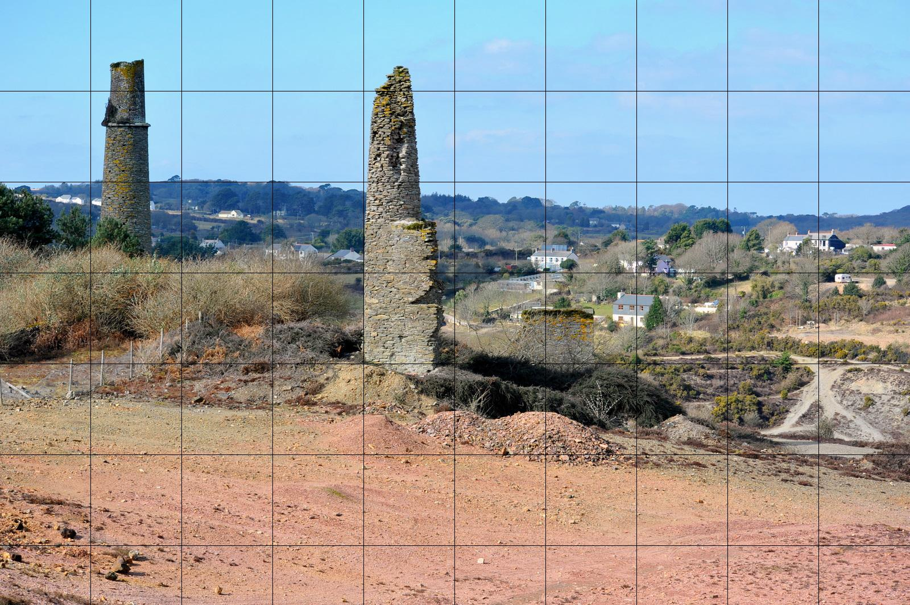

PyImageGrid
===========

PyImageGrid is a small python app that draws a grid on an image. It is intended for artists who want to draw using the grid method for proportions without having to print anything.

To install,

    git clone https://github.com/unanimousarc/imagegrid
    cd imagegrid
    python setup.py install

To use,

    python grid.py [-h] [-t filetype] path_to_image number_of_lines

Requirements
------------

Python Imaging Library (PIL) or Pillow will need to be installed (along with their dependencies) for image manipulation.

Features
--------

- The image will upscaled such that all of the grid squares are even in size
- Any output format can be specified
- Output path can also be specified

Screenshots
-----------

Before

After

(Image by Smalljim [Smalljim](http://en.wikipedia.org/wiki/Goon_Gumpas#mediaviewer/File:Goon_Gumpas_from_Wheal_Maid_DSC_2951.jpg) licensed under CC BY-SA 3.0)
